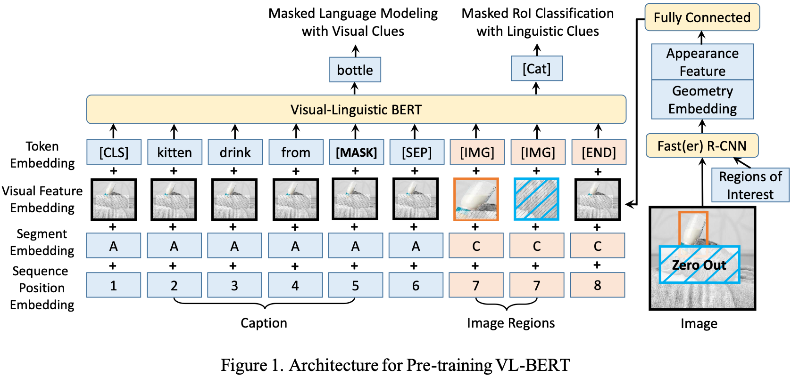
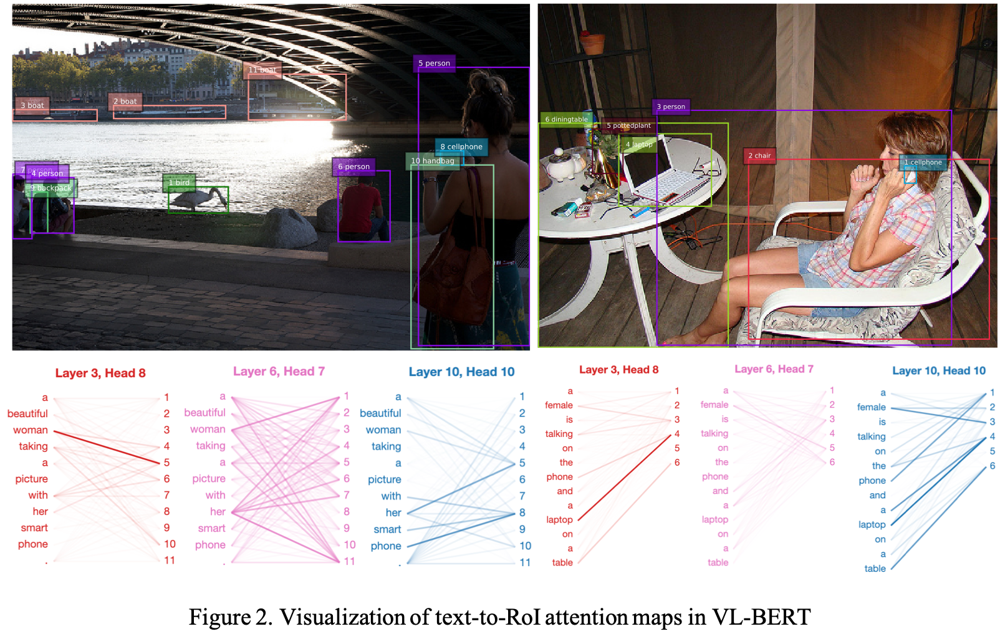

# VL-BERT

By 
[Weijie Su](https://www.weijiesu.com/), 
[Xizhou Zhu](https://scholar.google.com/citations?user=02RXI00AAAAJ&hl=en), 
[Yue Cao](http://yue-cao.me/), 
[Bin Li](http://staff.ustc.edu.cn/~binli/), 
[Lewei Lu](https://www.linkedin.com/in/lewei-lu-94015977/), 
[Furu Wei](http://mindio.org/), 
[Jifeng Dai](https://jifengdai.org/).

This repository is an official implementation of the paper 
[VL-BERT: Pre-training of Generic Visual-Linguistic Representations](https://arxiv.org/abs/1908.08530).


*Update on 2020/01/16* Add code of visualization.


*Update on 2019/12/20* Our VL-BERT got accepted by ICLR 2020.

## Introduction

VL-BERT is a simple yet powerful pre-trainable generic representation for visual-linguistic tasks. 
It is pre-trained on the massive-scale caption dataset and text-only corpus, 
and can be fine-tuned for various down-stream visual-linguistic tasks, 
such as Visual Commonsense Reasoning, Visual Question Answering and Referring Expression Comprehension.





Thanks to PyTorch and its 3rd-party libraries, this codebase also contains following features:
* Distributed Training
* FP16 Mixed-Precision Training
* Various Optimizers and Learning Rate Schedulers
* Gradient Accumulation
* Monitoring the Training Using TensorboardX

## Citing VL-BERT
```bibtex
@inproceedings{
  Su2020VL-BERT:,
  title={VL-BERT: Pre-training of Generic Visual-Linguistic Representations},
  author={Weijie Su and Xizhou Zhu and Yue Cao and Bin Li and Lewei Lu and Furu Wei and Jifeng Dai},
  booktitle={International Conference on Learning Representations},
  year={2020},
  url={https://openreview.net/forum?id=SygXPaEYvH}
}
```

## Prepare

### Environment
* Ubuntu 16.04, CUDA 9.0, GCC 4.9.4
* Python 3.6.x
    ```bash
    # We recommend you to use Anaconda/Miniconda to create a conda environment
    conda create -n vl-bert python=3.6 pip
    conda activate vl-bert
    ```
* PyTorch 1.0.0 or 1.1.0
    ```bash
    conda install pytorch=1.1.0 cudatoolkit=9.0 -c pytorch
    ```
* Apex (optional, for speed-up and fp16 training)
    ```bash
    git clone https://github.com/jackroos/apex
    cd ./apex
    pip install -v --no-cache-dir --global-option="--cpp_ext" --global-option="--cuda_ext" ./  
    ```
* Other requirements:
    ```bash
    pip install Cython
    pip install -r requirements.txt
    ```
* Compile
    ```bash
    ./scripts/init.sh
    ```

### Data

See [PREPARE_DATA.md](data/PREPARE_DATA.md).

### Pre-trained Models

See [PREPARE_PRETRAINED_MODELS.md](model/pretrained_model/PREPARE_PRETRAINED_MODELS.md).


## Training

### Distributed Training on Single-Machine

```
./scripts/dist_run_single.sh <num_gpus> <task>/train_end2end.py <path_to_cfg> <dir_to_store_checkpoint>
```
* ```<num_gpus>```: number of gpus to use.
* ```<task>```: pretrain/vcr/vqa/refcoco.
* ```<path_to_cfg>```: config yaml file under ```./cfgs/<task>```.
* ```<dir_to_store_checkpoint>```: root directory to store checkpoints.


Following is a more concrete example:
```
./scripts/dist_run_single.sh 4 vcr/train_end2end.py ./cfgs/vcr/base_q2a_4x16G_fp32.yaml ./
```

### Distributed Training on Multi-Machine

For example, on 2 machines (A and B), each with 4 GPUs, 

run following command on machine A:
```
./scripts/dist_run_multi.sh 2 0 <ip_addr_of_A> 4 <task>/train_end2end.py <path_to_cfg> <dir_to_store_checkpoint>
```

run following command on machine B:
```
./scripts/dist_run_multi.sh 2 1 <ip_addr_of_A> 4 <task>/train_end2end.py <path_to_cfg> <dir_to_store_checkpoint>
```


### Non-Distributed Training
```
./scripts/nondist_run.sh <task>/train_end2end.py <path_to_cfg> <dir_to_store_checkpoint>
```

***Note***:

1. In yaml files under ```./cfgs```, we set batch size for GPUs with at least 16G memory, you may need to adapt the batch size and 
gradient accumulation steps according to your actual case, e.g., if you decrease the batch size, you should also 
increase the gradient accumulation steps accordingly to keep 'actual' batch size for SGD unchanged.

2. For efficiency, we recommend you to use distributed training even on single-machine. But for RefCOCO+, you may meet deadlock
using distributed training due to unknown reason (it may be related to [PyTorch dataloader deadloack](https://github.com/pytorch/pytorch/issues/1355)), you can simply use
non-distributed training to solve this problem.

## Evaluation

### VCR
* Local evaluation on val set:
  ```
  python vcr/val.py \
    --a-cfg <cfg_of_q2a> --r-cfg <cfg_of_qa2r> \
    --a-ckpt <checkpoint_of_q2a> --r-ckpt <checkpoint_of_qa2r> \
    --gpus <indexes_of_gpus_to_use> \
    --result-path <dir_to_save_result> --result-name <result_file_name>
  ```
  ***Note***: ```<indexes_of_gpus_to_use>``` is gpu indexes, e.g., ```0 1 2 3```.

* Generate prediction results on test set for [leaderboard submission](https://visualcommonsense.com/leaderboard/):
  ```
  python vcr/test.py \
    --a-cfg <cfg_of_q2a> --r-cfg <cfg_of_qa2r> \
    --a-ckpt <checkpoint_of_q2a> --r-ckpt <checkpoint_of_qa2r> \
    --gpus <indexes_of_gpus_to_use> \
    --result-path <dir_to_save_result> --result-name <result_file_name>
  ```

### VQA
* Generate prediction results on test set for [EvalAI submission](https://evalai.cloudcv.org/web/challenges/challenge-page/163/overview):
  ```
  python vqa/test.py \
    --cfg <cfg_file> \
    --ckpt <checkpoint> \
    --gpus <indexes_of_gpus_to_use> \
    --result-path <dir_to_save_result> --result-name <result_file_name>
  ```

### RefCOCO+

* Local evaluation on val/testA/testB set:
  ```
  python refcoco/test.py \
    --split <val|testA|testB> \
    --cfg <cfg_file> \
    --ckpt <checkpoint> \
    --gpus <indexes_of_gpus_to_use> \
    --result-path <dir_to_save_result> --result-name <result_file_name>
  ```

## Visualization
See [VISUALIZATION.md](./viz/VISUALIZATION.md).

## Acknowledgements

Many thanks to following codes that help us a lot in building this codebase:
* [transformers (pytorch-pretrained-bert)](https://github.com/huggingface/transformers) 
* [Deformable-ConvNets](https://github.com/msracver/Deformable-ConvNets/)
* [maskrcnn-benchmark](https://github.com/facebookresearch/maskrcnn-benchmark)
* [mmdetection](https://github.com/open-mmlab/mmdetection)
* [r2c](https://github.com/rowanz/r2c)
* [allennlp](https://github.com/allenai/allennlp)
* [bottom-up-attention](https://github.com/peteanderson80/bottom-up-attention)
* [pythia](https://github.com/facebookresearch/pythia)
* [MAttNet](https://github.com/lichengunc/MAttNet)
* [bertviz](https://github.com/jessevig/bertviz)
